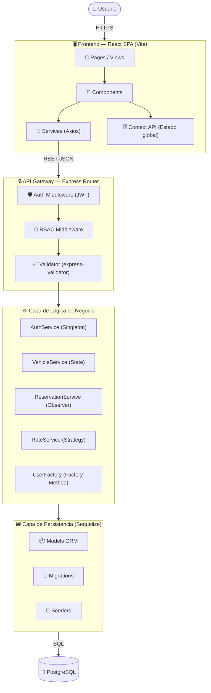

# 🚗 Car Rental SaaS

> Plataforma web SaaS para la digitalización y gestión centralizada de alquiler de vehículos con control de acceso por roles (RBAC).


---

## 📋 Tabla de Contenidos

- [Problema y Solución](#-problema-y-solución)
- [Objetivo del Proyecto](#-objetivo-del-proyecto)
- [Características Principales](#-características-principales)
- [Arquitectura del Sistema](#-arquitectura-del-sistema)
- [Modelo C4](#-modelo-c4)
- [Atributos de Calidad ISO 25010](#-atributos-de-calidad-iso-25010)
- [Estructura del Repositorio](#-estructura-del-repositorio)
- [Requisitos Previos](#-requisitos-previos)
- [Instalación y Ejecución](#-instalación-y-ejecución)
- [Credenciales de Prueba](#-credenciales-de-prueba)
- [Endpoints de la API](#-endpoints-de-la-api)
- [Decisiones Arquitectónicas](#-decisiones-arquitectónicas)
- [Roadmap](#-roadmap)
- [Equipo de Desarrollo](#-equipo-de-desarrollo)
- [Uso de IA](#-declaración-de-uso-de-ia)
- [Bibliografía](#-bibliografía)
- [Licencia](#-licencia)

---

## 🚨 Problema y Solución

### El Problema

Las empresas de alquiler de vehículos de pequeño y mediano tamaño operan con procesos altamente fragmentados que generan fricciones operativas significativas:

- 📄 **Formularios físicos** que se pierden, deterioran o quedan incompletos
- ✍️ **Contratos firmados presencialmente**, lo que obliga al cliente a desplazarse antes de recibir el vehículo
- 🔄 **Reprocesos constantes** por información incompleta o errónea capturada manualmente
- 👥 **Dependencia de múltiples empleados** para completar una sola transacción
- 📊 **Pérdida de trazabilidad** sobre el historial de reservas, pagos y estado de la flota
- 🗂️ **Información dispersa** en hojas de cálculo, papel y correos electrónicos sin integración

### La Solución

**Car Rental SaaS** reemplaza estos procesos por un flujo 100% remoto donde el cliente solo necesita acercarse a recoger el vehículo. La plataforma centraliza:

| Aspecto | Antes | Con Car Rental SaaS |
|---|---|---|
| Reserva | Presencial o por teléfono | Portal web con disponibilidad en tiempo real |
| Contrato | Papel + firma presencial | Flujo digital con validación remota |
| Historial | Archivos físicos | Registro centralizado por cliente |
| Gestión de flota | Hojas de cálculo | Catálogo con estados y disponibilidad |
| Control de acceso | Sin roles definidos | RBAC con tres niveles de permiso |
| Trazabilidad | Nula o parcial | Auditoría completa de operaciones |

---

## 🎯 Objetivo del Proyecto

### Objetivo Académico

Demostrar la aplicación práctica de principios de ingeniería de software en el diseño e implementación de un sistema de información real, cubriendo: arquitectura en capas, patrones de diseño GoF, modelado C4, control de acceso RBAC y evaluación de calidad bajo la norma ISO/IEC 25010.

### Objetivo Técnico

Construir una API REST robusta y una SPA React desacoplada que soporten los flujos operativos de una empresa de alquiler de vehículos, garantizando seguridad, mantenibilidad y escalabilidad desde el diseño.

---

## ✨ Características Principales

| Módulo | Descripción | Roles con acceso |
|---|---|---|
| **Autenticación** | Login JWT, refresh de sesión, gestión de contraseñas | Todos |
| **Catálogo de vehículos** | CRUD de vehículos, estados, categorías y tarifas | Empleado, Administrador |
| **Reservas** | Crear, consultar, cancelar y gestionar reservas con validación de disponibilidad | Cliente, Empleado, Administrador |
| **Gestión de clientes** | Registro, actualización y consulta del perfil del cliente | Cliente (propio), Empleado, Administrador |
| **Gestión de empleados** | Alta, baja y modificación de empleados | Administrador |
| **Control de roles** | Asignación y modificación de roles y permisos RBAC | Administrador |
| **Historial y auditoría** | Registro de operaciones con usuario, fecha y acción | Administrador |
| **Parámetros del sistema** | Configuración de tarifas, plazos y políticas | Administrador |

---

## 🏗️ Arquitectura del Sistema

### Diagrama de Flujo



### Descripción de Capas

| Capa | Responsabilidad | Tecnología |
|---|---|---|
| **Presentación** | Renderizado de vistas, manejo de estado local y comunicación con la API | React 18, Vite, CSS-in-JS |
| **API / Gateway** | Enrutamiento, autenticación, autorización y validación de entrada | Express 4, JWT, express-validator |
| **Lógica de Negocio** | Reglas del dominio, cálculo de tarifas, transiciones de estado y eventos | Node.js 20, servicios propios |
| **Persistencia** | Mapeo objeto-relacional, migraciones y consultas a la base de datos | Sequelize 6, PostgreSQL |

### Patrones de Diseño GoF

| Patrón | Tipo | Problema que resuelve | Archivo(s) clave |
|---|---|---|---|
| **Singleton** | Creacional | Garantiza una única instancia del servicio de autenticación y pool de conexión | `AuthService.js`, `database.js` |
| **Factory Method** | Creacional | Crea instancias de usuario según el rol sin acoplar al cliente con la clase concreta | `UserFactory.js` |
| **Strategy** | Comportamiento | Permite intercambiar algoritmos de cálculo de tarifa (diaria, semanal, mensual) en tiempo de ejecución | `RateStrategy.js`, `strategies/` |
| **State** | Comportamiento | Gestiona las transiciones válidas del estado de un vehículo (disponible, reservado, en mantenimiento) | `VehicleStateMachine.js` |
| **Observer** | Comportamiento | Notifica a los módulos suscritos (auditoría, notificaciones) cuando ocurre un evento post-reserva | `EventEmitter`, `ReservationService.js` |

---

## 📐 Modelo C4

El sistema está documentado siguiendo el modelo C4 (Simon Brown). Los diagramas PlantUML se encuentran en `/docs`.

| Nivel | Nombre | Descripción |
|---|---|---|
| **C1** | Contexto | Muestra el sistema en relación con los usuarios (Cliente, Empleado, Administrador) y sistemas externos |
| **C2** | Contenedores | Detalla el Frontend SPA, la API REST y la base de datos PostgreSQL como contenedores independientes |
| **C3** | Componentes | Desglosa la API en sus capas internas: Router, Middleware, Services y Models |
| **C4** | Clases | Describe las entidades del dominio, sus atributos, métodos y relaciones en UML |

> 📁 Los archivos `.puml` se encuentran en `docs/c4/` del repositorio.

---

## 📊 Atributos de Calidad ISO 25010

| Atributo | Métrica | Cómo se implementa |
|---|---|---|
| **Seguridad** | Autenticación y autorización en cada endpoint | JWT firmado + middleware RBAC por ruta |
| **Mantenibilidad** | Bajo acoplamiento entre capas | Arquitectura en capas + inyección implícita de dependencias |
| **Funcionalidad** | Cobertura de casos de uso definidos | Módulos de auth, vehículos, reservas, clientes y auditoría |
| **Portabilidad** | Configuración por entorno | Variables de entorno con `.env` para cada despliegue |
| **Confiabilidad** | Integridad de datos en operaciones críticas | Transacciones Sequelize en reservas y actualizaciones de estado |
| **Usabilidad** | Flujo de reserva sin presencia física | SPA con navegación por roles y feedback visual inmediato |
| **Rendimiento** | Tiempo de respuesta de la API | Consultas optimizadas con Sequelize, índices en FK y campos de búsqueda frecuente |
| **Trazabilidad** | Registro de operaciones críticas | Módulo de auditoría con actor, acción, entidad y timestamp |

---

## 📁 Estructura del Repositorio

```
car-rental-saas/
│
├── AlquilerSaaS-front/               # React SPA
│   ├── public/
│   ├── src/
│   │   ├── assets/                   # Imágenes y recursos estáticos
│   │   ├── components/               # Componentes reutilizables
│   │   │   ├── common/               # Botones, inputs, modales genéricos
│   │   │   ├── layout/               # Navbar, Sidebar, Footer
│   │   │   └── vehicle/              # Tarjetas y formularios de vehículos
│   │   ├── context/                  # Context API (Auth, App state)
│   │   ├── hooks/                    # Custom hooks
│   │   ├── pages/                    # Vistas por módulo
│   │   │   ├── auth/                 # Login, Register
│   │   │   ├── vehicles/             # Catálogo, detalle, CRUD
│   │   │   ├── reservations/         # Crear, listar, gestionar
│   │   │   ├── clients/              # Perfil y gestión
│   │   │   ├── employees/            # Gestión de empleados
│   │   │   └── admin/                # Panel de administración
│   │   ├── services/                 # Clientes Axios por recurso
│   │   ├── utils/                    # Helpers, constantes, validadores
│   │   ├── App.jsx
│   │   └── main.jsx
│   ├── .env.example
│   ├── index.html
│   ├── package.json
│   └── vite.config.js
│
├── AlquilerSaaS-back/                # Node.js REST API
│   ├── src/
│   │   ├── config/                   # Configuración de BD y variables de entorno
│   │   │   └── database.js           # Singleton de conexión Sequelize
│   │   ├── controllers/              # Controladores HTTP por recurso
│   │   ├── middlewares/              # Auth JWT, RBAC, manejo de errores
│   │   ├── models/                   # Modelos Sequelize (ORM)
│   │   ├── routes/                   # Definición de rutas Express
│   │   ├── services/                 # Lógica de negocio
│   │   │   ├── AuthService.js        # Singleton
│   │   │   ├── UserFactory.js        # Factory Method
│   │   │   ├── VehicleStateMachine.js# State
│   │   │   ├── RateStrategy.js       # Strategy
│   │   │   └── ReservationService.js # Observer
│   │   ├── utils/                    # Helpers y utilidades
│   │   └── app.js                    # Configuración Express
│   ├── migrations/                   # Migraciones Sequelize
│   ├── seeders/                      # Datos iniciales
│   ├── .env.example
│   ├── package.json
│   └── server.js                     # Punto de entrada
│
├── docs/
│   └── c4/                           # Diagramas PlantUML C4
│       ├── c1_context.puml
│       ├── c2_containers.puml
│       ├── c3_components.puml
│       └── c4_classes.puml
│
├── .gitignore
├── README.md
└── LICENSE
```

---

## ⚙️ Requisitos Previos

| Herramienta | Versión mínima | Notas |
|---|---|---|
| Node.js | 20.x LTS | [nodejs.org](https://nodejs.org) |
| npm | 10.x | Incluido con Node.js 20 |
| PostgreSQL | 15+ | [postgresql.org](https://postgresql.org) |
| Git | 2.40+ | [git-scm.com](https://git-scm.com) |

---

## 🚀 Instalación y Ejecución

### 1. Clonar el repositorio

```bash
git clone https://github.com/<tu-usuario>/car-rental-saas.git
cd car-rental-saas
```

### 2. Configurar el Backend

#### Variables de entorno

```bash
cd AlquilerSaaS-back
cp .env.example .env
```

Edita el archivo `.env` con tus valores:

| Variable | Descripción | Ejemplo |
|---|---|---|
| `PORT` | Puerto en que corre la API | `3000` |
| `DB_HOST` | Host de PostgreSQL | `localhost` |
| `DB_PORT` | Puerto de PostgreSQL | `5432` |
| `DB_NAME` | Nombre de la base de datos | `car_rental_db` |
| `DB_USER` | Usuario de PostgreSQL | `postgres` |
| `DB_PASSWORD` | Contraseña de PostgreSQL | `tu_password` |
| `JWT_SECRET` | Clave secreta para firmar tokens | `una_clave_larga_y_segura` |
| `JWT_EXPIRES_IN` | Tiempo de expiración del token | `24h` |
| `NODE_ENV` | Entorno de ejecución | `development` |

#### Instalar dependencias del backend

```bash
npm install
```

#### Ejecutar migraciones y seeders

```bash
# Crear la base de datos (si no existe)
npx sequelize-cli db:create

# Ejecutar migraciones
npx sequelize-cli db:migrate

# Cargar datos iniciales (roles, admin por defecto, vehículos de prueba)
npx sequelize-cli db:seed:all
```

#### Iniciar el servidor backend

```bash
# Desarrollo (con nodemon)
npm run dev

# Producción
npm start
```

> La API quedará disponible en `http://localhost:3000`

---

### 3. Configurar el Frontend

```bash
cd ../AlquilerSaaS-front
cp .env.example .env
```

Edita `.env`:

```env
VITE_API_URL=http://localhost:3000/api
```

#### Instalar dependencias del frontend

```bash
npm install
```

#### Iniciar el servidor de desarrollo

```bash
npm run dev
```

> La aplicación quedará disponible en `http://localhost:5173`

---

## 🔑 Credenciales de Prueba

> ⚠️ Estas credenciales son generadas por los seeders. Cámbialas en producción.

| Rol | Correo | Contraseña | Permisos principales |
|---|---|---|---|
| **Administrador** | `admin@carrental.com` | `Admin123!` | Acceso total: roles, parámetros, auditoría, empleados |
| **Empleado** | `empleado@carrental.com` | `Empleado123!` | Gestión de vehículos, reservas y clientes |
| **Cliente** | `cliente@carrental.com` | `Cliente123!` | Ver catálogo, crear reservas, ver historial propio |

---

## 📡 Endpoints de la API

> Base URL: `http://localhost:3000/api`

<details>
<summary><strong>🔐 Auth</strong></summary>

| Método | Ruta | Descripción | Rol requerido |
|---|---|---|---|
| `POST` | `/auth/register` | Registrar nuevo usuario | Público |
| `POST` | `/auth/login` | Iniciar sesión, retorna JWT | Público |
| `POST` | `/auth/logout` | Cerrar sesión | Autenticado |
| `GET` | `/auth/me` | Obtener perfil del usuario actual | Autenticado |
| `PUT` | `/auth/change-password` | Cambiar contraseña | Autenticado |

</details>

<details>
<summary><strong>🚗 Vehículos</strong></summary>

| Método | Ruta | Descripción | Rol requerido |
|---|---|---|---|
| `GET` | `/vehicles` | Listar vehículos disponibles | Público |
| `GET` | `/vehicles/:id` | Detalle de un vehículo | Público |
| `POST` | `/vehicles` | Crear nuevo vehículo | Empleado, Admin |
| `PUT` | `/vehicles/:id` | Actualizar vehículo | Empleado, Admin |
| `PATCH` | `/vehicles/:id/status` | Cambiar estado del vehículo | Empleado, Admin |
| `DELETE` | `/vehicles/:id` | Eliminar vehículo (soft delete) | Admin |

</details>

<details>
<summary><strong>📅 Reservas</strong></summary>

| Método | Ruta | Descripción | Rol requerido |
|---|---|---|---|
| `GET` | `/reservations` | Listar todas las reservas | Empleado, Admin |
| `GET` | `/reservations/my` | Listar reservas del cliente autenticado | Cliente |
| `GET` | `/reservations/:id` | Detalle de una reserva | Cliente (propia), Empleado, Admin |
| `POST` | `/reservations` | Crear nueva reserva | Cliente |
| `PATCH` | `/reservations/:id/cancel` | Cancelar reserva | Cliente (propia), Empleado, Admin |
| `PATCH` | `/reservations/:id/confirm` | Confirmar reserva | Empleado, Admin |
| `PATCH` | `/reservations/:id/complete` | Marcar reserva como completada | Empleado, Admin |

</details>

<details>
<summary><strong>👥 Clientes</strong></summary>

| Método | Ruta | Descripción | Rol requerido |
|---|---|---|---|
| `GET` | `/clients` | Listar todos los clientes | Empleado, Admin |
| `GET` | `/clients/:id` | Perfil de un cliente | Cliente (propio), Empleado, Admin |
| `PUT` | `/clients/:id` | Actualizar datos del cliente | Cliente (propio), Admin |
| `DELETE` | `/clients/:id` | Deshabilitar cliente (soft delete) | Admin |

</details>

<details>
<summary><strong>🧑‍💼 Empleados</strong></summary>

| Método | Ruta | Descripción | Rol requerido |
|---|---|---|---|
| `GET` | `/employees` | Listar empleados | Admin |
| `GET` | `/employees/:id` | Perfil de un empleado | Admin |
| `POST` | `/employees` | Crear empleado | Admin |
| `PUT` | `/employees/:id` | Actualizar empleado | Admin |
| `DELETE` | `/employees/:id` | Deshabilitar empleado (soft delete) | Admin |

</details>

<details>
<summary><strong>📋 Auditoría</strong></summary>

| Método | Ruta | Descripción | Rol requerido |
|---|---|---|---|
| `GET` | `/audit` | Listar registros de auditoría | Admin |
| `GET` | `/audit?entity=reservations` | Filtrar auditoría por entidad | Admin |
| `GET` | `/audit?userId=:id` | Filtrar auditoría por usuario | Admin |

</details>

---

## 🧭 Decisiones Arquitectónicas

| Decisión | Alternativa considerada | Justificación |
|---|---|---|
| **Base de datos relacional (PostgreSQL)** | MongoDB (NoSQL) | El dominio tiene relaciones fuertes (cliente → reserva → vehículo → tarifa). La integridad referencial y las transacciones ACID son críticas para consistencia de datos |
| **API REST** | GraphQL | El modelo de recursos es claro y estable. REST reduce la curva de aprendizaje y simplifica el control de acceso por método HTTP en middlewares RBAC |
| **JWT stateless** | Sesiones en servidor | Facilita el despliegue desacoplado de front y back sin compartir estado. Escala horizontalmente sin infraestructura de sesiones compartidas |
| **Soft delete** | Hard delete | Preserva la trazabilidad histórica de reservas, clientes y vehículos. Requisito de auditoría y posible recuperación de datos |
| **Sequelize ORM** | Consultas SQL directas (pg) | Reduce el código repetitivo de acceso a datos, provee migraciones versionadas y facilita cambios de esquema controlados en equipo |

---

## 🗺️ Roadmap

| Fase | Descripción | Estado |
|---|---|---|
| **Fase 1** | Definición de arquitectura, modelos C4 y estructura base del repositorio | ✅ Completado |
| **Fase 2** | Backend: migraciones, modelos, autenticación JWT y RBAC | ✅ Completado |
| **Fase 3** | Backend: módulos de vehículos, reservas, clientes y auditoría | ✅ Completado |
| **Fase 4** | Frontend: autenticación, layout con roles y catálogo de vehículos | ✅ Completado |
| **Fase 5** | Frontend: flujo completo de reservas y panel de administración | 🔄 En progreso |
| **Fase 6** | Integración end-to-end, pruebas y refinamiento de UX | 🔜 Pendiente |
| **Fase 7** | Documentación final, diagramas C4 completos y presentación | 🔜 Pendiente |
| **Fase 8** | Despliegue en entorno de staging (Railway / Render) | 🔜 Pendiente |

---

## 👥 Equipo de Desarrollo

| Nombre | Rol en el proyecto | GitHub |
|---|---|---|
| Andrés Gómez | Arquitecto y Desarrollador Full Stack | [@username](https://github.com/username) |

---

## 🤖 Declaración de Uso de IA

Este proyecto utilizó herramientas de inteligencia artificial generativa como apoyo en el proceso de desarrollo:

| Herramienta | Propósito |
|---|---|
| **Claude (Anthropic)** | Revisión de código, sugerencias de patrones GoF, generación de estructura base de componentes y apoyo en redacción técnica |
| **GitHub Copilot** | Autocompletado de código repetitivo (CRUD controllers, validadores, rutas) |

### Decisiones exclusivamente humanas

- ✅ Selección de la arquitectura en capas y justificación técnica
- ✅ Elección de los patrones GoF aplicados y su mapeo al dominio
- ✅ Diseño del modelo de datos y relaciones entre entidades
- ✅ Definición del modelo RBAC y los permisos por rol
- ✅ Evaluación y selección del stack tecnológico
- ✅ Todas las decisiones arquitectónicas documentadas en ADR

> El uso de IA fue instrumental, no sustitutivo. Todo el código fue revisado, comprendido y adaptado por el equipo.

---

## 📚 Bibliografía

Bass, L., Clements, P., & Kazman, R. (2021). *Software architecture in practice* (4th ed.). Addison-Wesley Professional.

Brown, S. (2018). *The C4 model for visualising software architecture*. Leanpub. https://c4model.com

Gamma, E., Helm, R., Johnson, R., & Vlissides, J. (1994). *Design patterns: Elements of reusable object-oriented software*. Addison-Wesley.

International Organization for Standardization. (2011). *ISO/IEC 25010:2011 — Systems and software engineering: Systems and software quality requirements and evaluation (SQuaRE) — System and software quality models*. ISO.

Martin, R. C. (2017). *Clean architecture: A craftsman's guide to software structure and design*. Prentice Hall.

---

## 📄 Licencia

Este proyecto está licenciado bajo la Licencia MIT. Consulta el archivo [LICENSE](LICENSE) para más detalles.

```
MIT License

Copyright (c) 2025 Andrés Gómez

Permission is hereby granted, free of charge, to any person obtaining a copy
of this software and associated documentation files (the "Software"), to deal
in the Software without restriction, including without limitation the rights
to use, copy, modify, merge, publish, distribute, sublicense, and/or sell
copies of the Software, and to permit persons to whom the Software is
furnished to do so, subject to the following conditions:

The above copyright notice and this permission notice shall be included in all
copies or substantial portions of the Software.

THE SOFTWARE IS PROVIDED "AS IS", WITHOUT WARRANTY OF ANY KIND, EXPRESS OR
IMPLIED, INCLUDING BUT NOT LIMITED TO THE WARRANTIES OF MERCHANTABILITY,
FITNESS FOR A PARTICULAR PURPOSE AND NONINFRINGEMENT.
```

---

<div align="center">

**Desarrollado con propósito académico y visión de producción**

</div>
